# CTP Fall Data Science 2026

## Syllabi  Links

- [Wednesdays 06:30 PM - 09:00 PM](https://docs.google.com/document/d/1ZA_iaWhoA4xZKuWKjHiswWUcrtVA_Hl96pqPkXXCGlI/edit?tab=t.0)
- [Thursdays 06:30 PM - 09:00 PM](https://docs.google.com/document/d/1TJHfFqFKC_JWYLoAVT0ZVoJw3UH3orEUMjwt6STUx3U/edit?usp=sharing)
- [Fridays 12:30 PM - 03:00 PM](https://docs.google.com/document/d/1Q2AFYANmk0f1G2ZeeIG8NCoKc3KIqgKRZ99sbM8ffss/edit?usp=sharing)
- [Fridays 06:30 PM - 09:00 PM](https://docs.google.com/document/d/1xo_kQbGIxf4IZTDMgcAc534TN_CaWD45jkcW2Dbx-0w/edit?usp=sharing)

## Git Setup & Homework Workflow Instructions

How your work moves from the class repo to a graded submission. Read this carefully to set yourself up for success !!⚠️

## The Big Picture

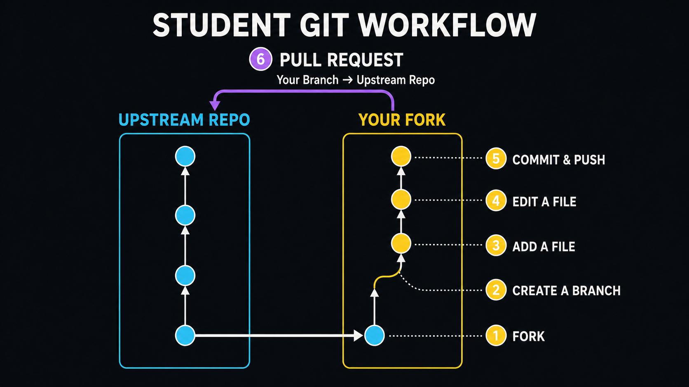

Three things you're working with:

- **Upstream repo** — the class repo. You don't have write access, and you shouldn't need it.
- **Your fork** — your personal copy of the class repo, under your own GitHub account. This is where you actually work.
- **Branches** — a separate "lane" inside your fork for one specific piece of work (like this week's homework), so it doesn't touch your `main`.

**In git terms**, those map to specific remote names — you'll see these in the terminal and in GitHub's UI:

```bash
upstream          → CUNYTechPrep/2026-ds-fall       (the class repo)
origin            → YOUR-GITHUB-NAME/2026-ds-fall   (your fork)
origin/main       → your fork's main branch
origin/week1      → your fork's week1 branch (this week's work)
```

`origin` is set automatically the moment you clone or open a Codespace from your fork — every push you do goes to `origin`. `upstream` is just what we call the class repo when we're talking about it; you don't need a local `upstream` remote for anything in this doc, since syncing happens through GitHub's **Sync fork** button, not the command line.

Why fork instead of working directly in the class repo? Isolation. Nothing you do in your fork can break the repo for anyone else, so you have full freedom to experiment.

Why branch instead of just committing to your fork's `main`? Same idea, one level down. Each week gets its own branch (`week1`, `week2`, ...) so your `main` stays a clean mirror of the class repo, and each week's work is easy to review on its own.

The steps, in order: **fork → branch → Codespace → copy the exercise → submit → open a PR**.

---

## 1. Fork

Fork the class repo to your own GitHub account (once, at the start of the semester).

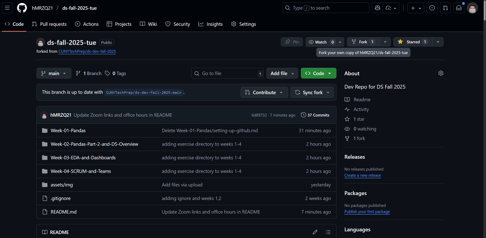
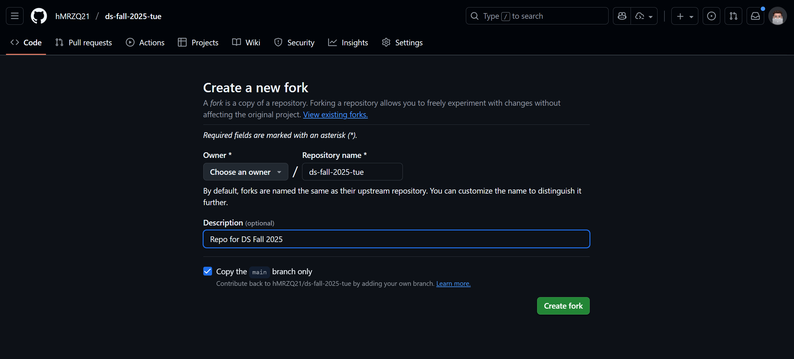

**Every week after that:** before you make a new branch, go to your fork on `main` and **Sync fork** so you pick up merged PRs and new files from the class repo.

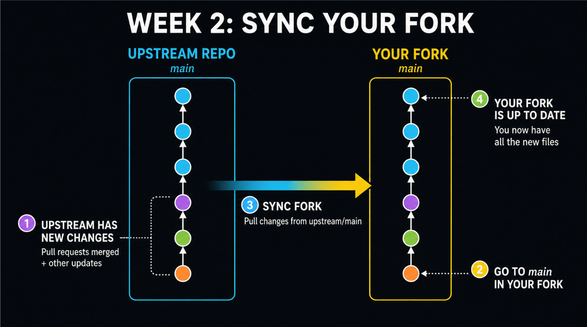
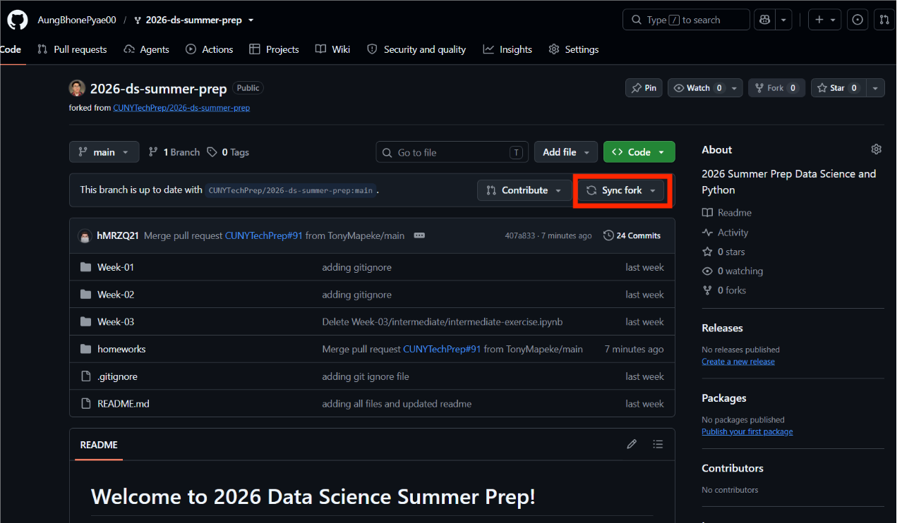

---

## 2. Branch

On your fork, create a branch off the updated `main`, named `week{x}` (example: `week1`).

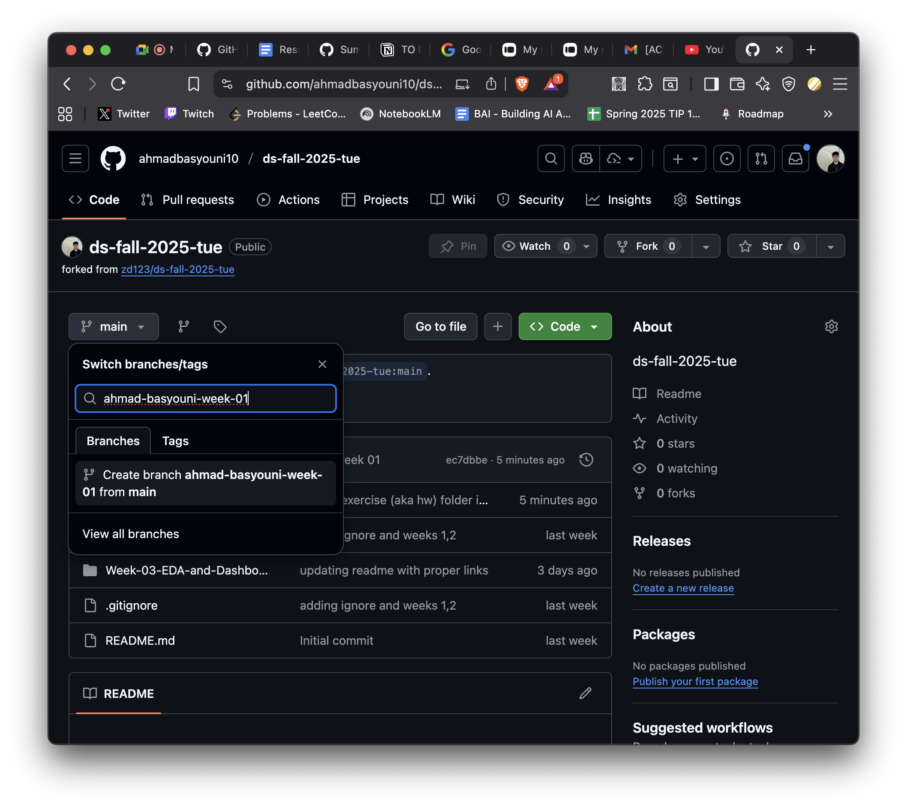

---

## 3. Codespace (browser or VS Code)

Press **Code** on your fork and create a Codespace **on this week's branch**.

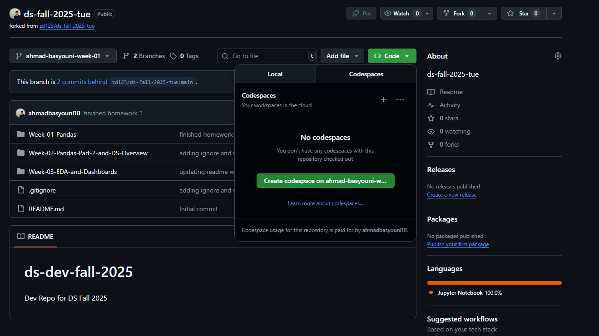
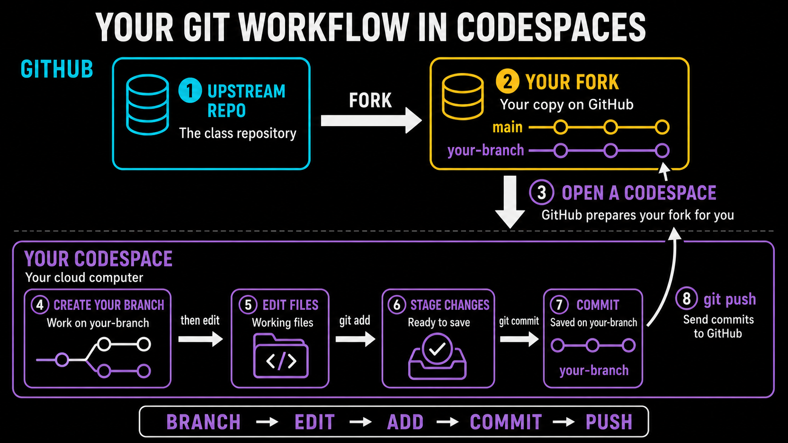

That opens in the browser. Browser Codespaces work, but opening the same Codespace in **local VS Code is more stable**.

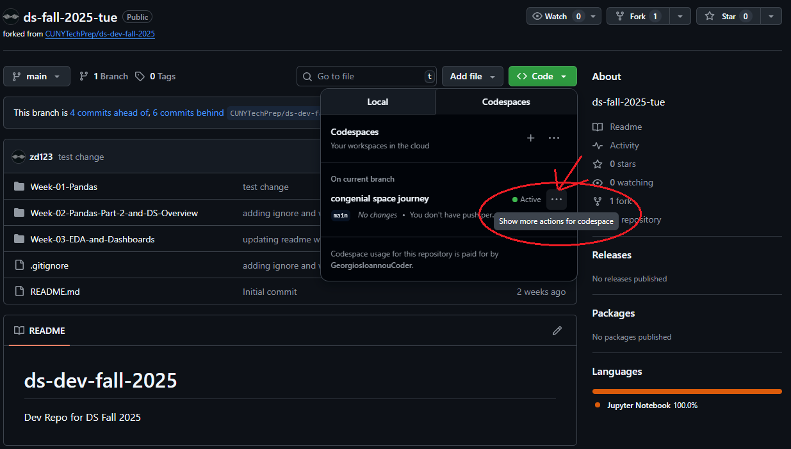
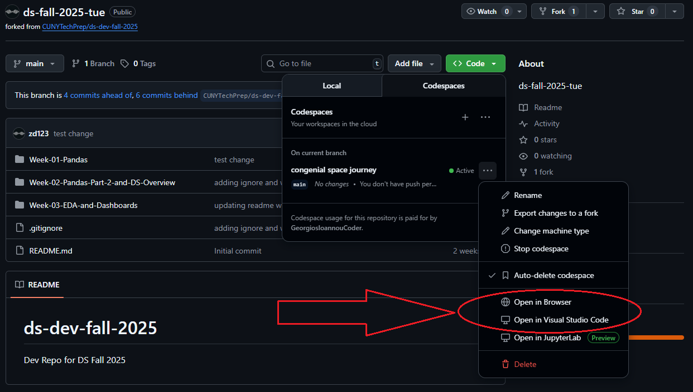

In the terminal, run `git status` to confirm you're on `week{x}`. If you're not, `git switch week{x}`.

---

## 4. Copy the exercise and rename it

**Don't edit the exercise file directly.** Copy it into `homeworks/`, rename it with your initials, and work on the copy.

Examples:

- `homeworks/HM_Week_1_HW.ipynb`
- `homeworks/HM_week_03_exercise.ipynb`

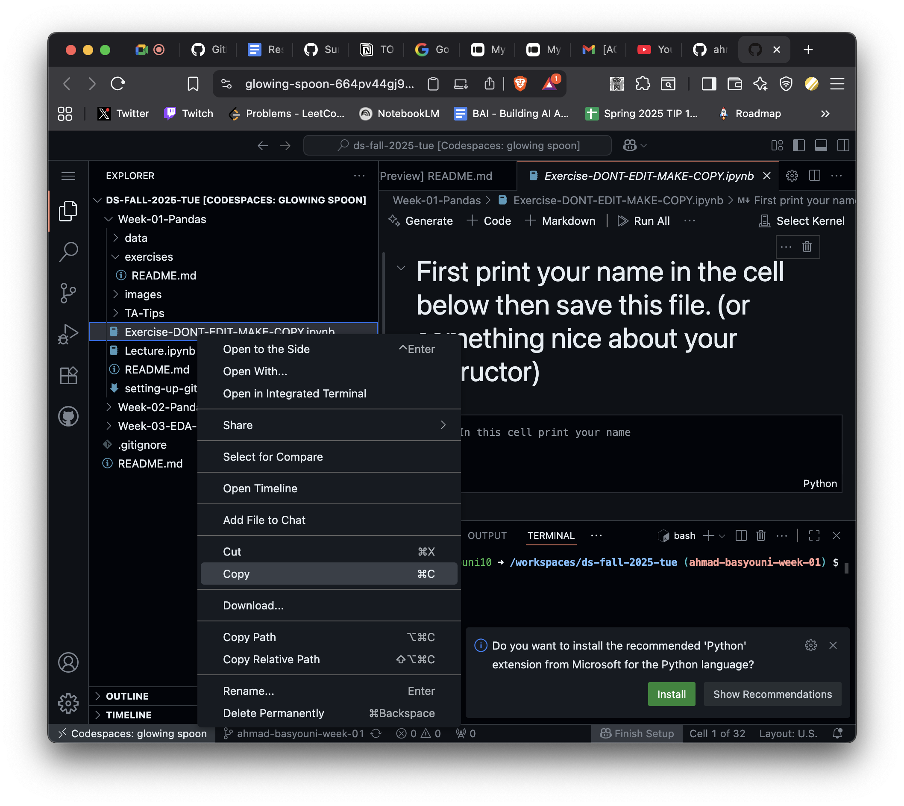

Complete the questions in **your** copy and run the cells.

---

## 5. Submit (add, commit, push)

Stage **only your file** — NOT `git add .` That is the single biggest avoidable cause of merge conflicts.

```bash
git status
git add homeworks/HM_Week_1_HW.ipynb
git commit -m "completed week 1 hw"
git push
```

First push on a brand-new branch prompts you to set an upstream — accept it, or run `git push --set-upstream origin week{x}`. Either way, this goes to *your fork*, not the class repo.

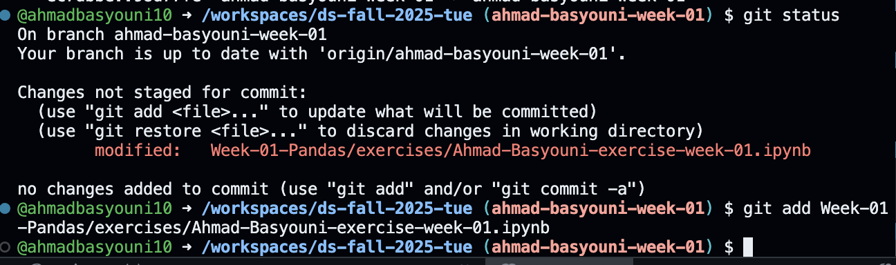

You can do the same steps in the GUI instead. Same result.

---

## 6. Pull Request

This is the step that actually submits your work.

A pull request (PR) is a proposal: "take the commits on my branch and merge them into the upstream repo." Opening one shows a diff — an exact, line-by-line view of what you're proposing to add.

1. **Open the PR.** After you push, GitHub shows a **Compare & pull request** banner on your fork — click it. Don't see it? Go to your fork → **Pull requests** → **New pull request**, or use **Contribute**.

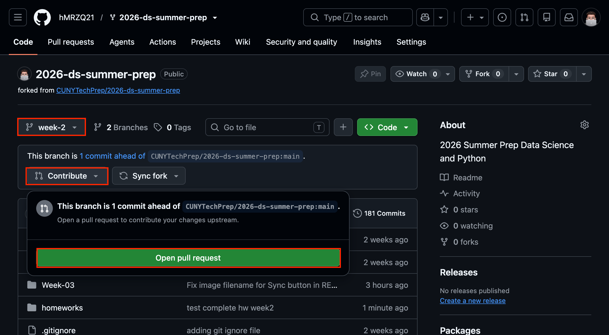

2. **Check the direction & Review the diff.** Base should be the upstream repo's `main`; compare should be your `week{x}` branch. You're proposing to merge your branch into the class repo, not the other way around. Add a short description of what you did, etc.

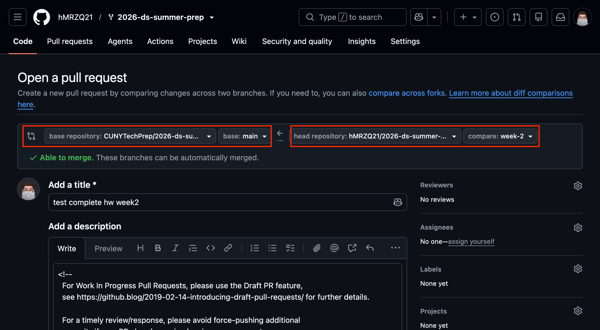

Why we do it this way instead of pushing straight to `main`:

- **It's how real teams work.** Nobody with production access pushes straight to `main` at a real job — everything goes through a PR and a review first. This is that habit, early.
- **It's a checkpoint.** A PR is a moment where something (a person, a CI check) looks at your change before it lands anywhere permanent.
- **It's literally how you submit.** For us, the PR *is* the handoff — it's what gets graded.


---

## 7. Video Walkthrough

Click the thumbnail to open the walkthrough (GitHub won't play a Drive embed in the README itself):

[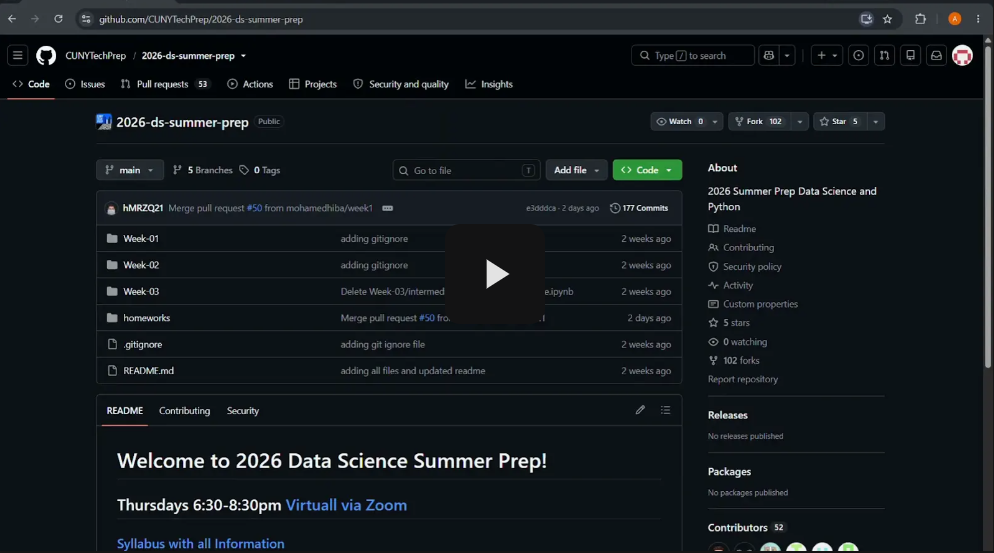](https://drive.google.com/file/d/1sG88k-EpimCImHG6R1geW6BaZ6aLOcIl/view?usp=drive_link)

[Watch on Google Drive](https://drive.google.com/file/d/1sG88k-EpimCImHG6R1geW6BaZ6aLOcIl/view?usp=drive_link)

---

## 8. PR Bot

After you open a PR, our **github-actions[bot]** reviews it automatically.

It checks that:

1. Your branch has **no merge conflict** with `main` (sync your fork first if you're behind).
2. The PR contains **exactly one homework notebook**, named correctly, inside `homeworks/`.
3. You **didn't touch other files** (including the `DONT_EDIT_MAKE_COPY` template).
4. The notebook is actually **filled in**, not an empty copy.

If all four pass, the bot **merges the PR for you**.

If something fails, the bot leaves a **Request changes** review explaining what to fix. Fix it on the same branch, push again, and it will re-check. You don't merge the PR yourself.

Accepted filenames look like:

- `homeworks/HM_Week_1_HW.ipynb`
- `homeworks/HM_week_03_exercise.ipynb`

`git add .` is how people accidentally include extra files and fail the bot. Add only your homework file.

DM us if you think the bot made a mistake and we'll review your work and leave comments if anything needs fixing. Once it's approved, it gets merged. You don't need to merge it yourself.

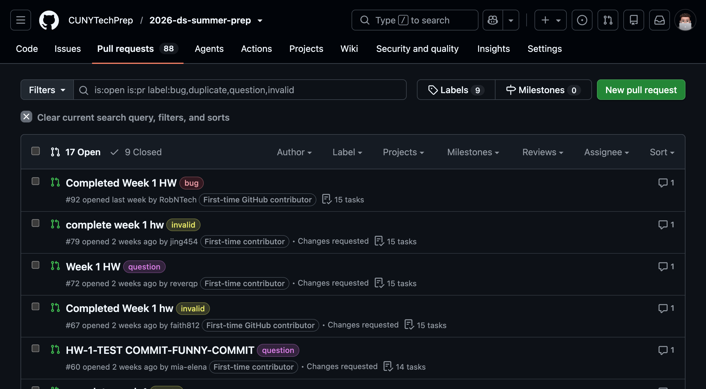
___

## Homework Submission
- All homework is due at 12:01 PM (noon) the day before the next class.
- Submit GitHub links to your PR completed exercise.

## Homework Instructions: How to hand in your HWs.
__HW assignments can be found in that each weeks README.md file. Open that weeks folder to find assignment__

__All HWs are due at 12:01 PM (noon) the day before the next class__

- Wednesday's class: HW due 12:01 PM on Tuesday
- Thursday's class: HW due 12:01 PM on Wednesday
- Friday's (both 12:30 PM and 06:30 PM): HW due 12:01 PM on Thursday

## There are usually 3 sections of HW every week.

### #1 Pre-Class HW [~1hr]
This covers the topic we are about to teach.  This is HW that will help you come to class better prepared to learn the material that week.
* Watch / read / do the tutorial listed above.
* Go to your class slack channel.  
* Find the usually most recent message from your TA instructor that says "Week X: Pre-Class learnings".
* Respond in-thread to that message with least one thing you learned from the videos/reading/or tutorial.
	* Your response can be It can be as short as one sentence, or as long as a book.
* Still in Slack, copy the link to your response.
* Pasted that to your response in HW Submission sheets Pre-Class column for that week.

__Submit by pasting the link to your message under the "Pre-Class Slack Link" column.__

### #2 Exercise HW [~1hr]
This is a coding assignment that you usually start in class.  It is located in the `Exercise-DONT-EDIT-MAKE-COPY.ipynb` file.  See detaild instructions below. (Paste link in HW Submission sheet.)

0. Make a copy of `Exercise-DONT-EDIT-MAKE-COPY.ipynb`
0. Name the new copy as `Exercise-[YOUR-INITIALS].ipynb`. Zack DeSario's would be `Exercise-ZD.ipynb`.
0. Complete all the questions in YOUR COPY of the exercise file.
0. Push that file to your fork.
    ```bash
    ## NEVER DO --> git add .
    git add YOUR-EXERCISE-FILE.ipynb
    git commit -m 'YOUR COMMIT MESSAGE'
    git push
    ```
0. Open your github fork on the internet, click on your HW file you just pushed. Copy that exact link.
0. Copy that exact link, and paste it into the HW submission sheet in the Exercise column for that week.

__Submit by pasting the link in the HW Submission sheet under the "Exercise.ipynb" column.__

### #3 LinkedIn Post [~10min]
Every week you have to post on LinkedIn. It can be anthing data science related unless instructed otherwise.

Publish the post (make sure its a public post.)

If no specific post topic is given that week, here are some topic ideas you can use.
* It can be about starting your CTP journey.
* Asking for advice on most important things to learn for entry level roles.
* Something you leanred in the pre-class videos.
* Why you love or hate pandas.
* Your favorite part about the class.
* A tip or trick that your learned in class.
* Anything related to data science or your journey.

Submit by putting the link to your LI post under the "LinkedIn Post" column.
